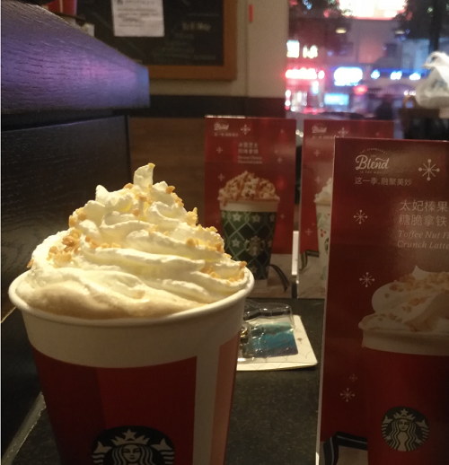
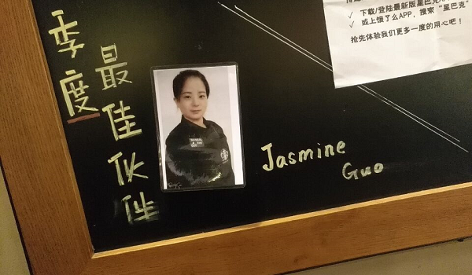
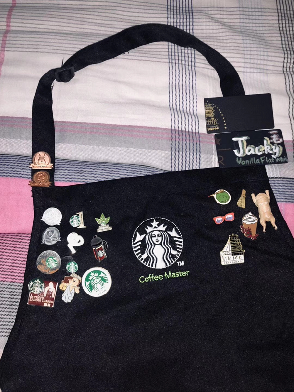

# 20181117-武汉星巴克的日常

BRICKEA

2018年11月18日

武汉气温骤降，南方的朋友们都喜提了秋裤

> 外面再冷，店里的咖啡总会是热的

刚来到店里的时候，十几分钟一次的lobby是我最喜欢干的事情

谁叫我啥都不会，只会熟练地洗盘子

> 这就是咱们店，武汉第八家

Chris老说我喜欢司门口的店，说干脆给我调过去得了

确实是喜欢啊，但凡事都得讲个本分嘛

要不是Chris把我招进来，我哪有机会认识这么多有意思的人

咱不是忘本的人，喜欢归喜欢，去还是不会去的，这是娘家，哪有说嫁就嫁了的？

> Jasmine比我们大部分人都大，大家都叫她姐姐

姐姐也是最一开始带我的师傅

从她那里我学到了许多最根本的东西

该怎么记笔记，每个工作位置比较重要的又是什么

大部分就是这种决定做事方向的东西吧

抛开工作

学到的还有就是那份对生活还有对自己的一份坦然

> Jacky干了三年，有着一条满是勋章的围裙

其实平常新伙伴都会有一个师傅固定带

但我却是一个吃百家饭的

还有往这锅里加了不少料的就是Jacky了

叫毛毛会更亲切些

给我最深印象大概就是毛毛很冷静

无论顾客是喝酒的，急着上厕所的，无法理喻的

他都能处理得当

没事拉我一起出去抽根烟

世界又淡定了不少

---

## [看完了点我](../README.md)