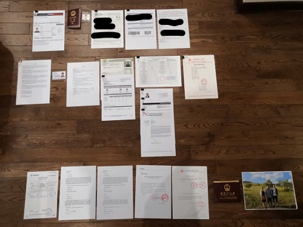
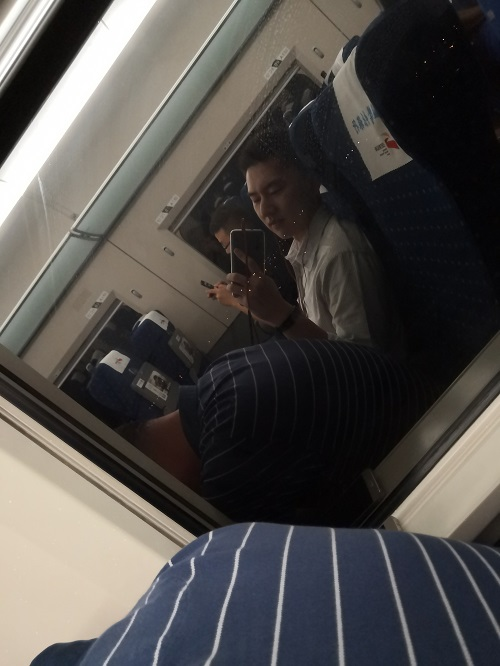
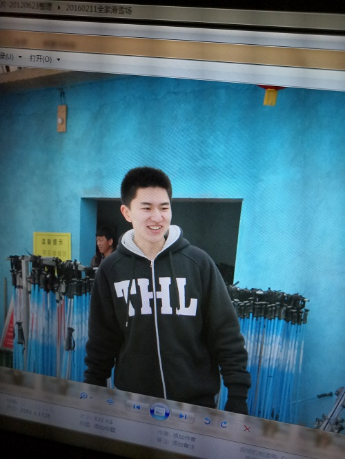

# 2019年6月30日美帝面签

当初正好中美关系比较紧张，我面完的第二天政策就收紧了

其实也没什么难的，美国大使馆对非移民签证的面试原则就是看你有没有移民倾向，所有问题都围绕这个来，材料准备好就好

> 当时大概整理了这些，结果也就只批了一年

材料像是护照、身份证、I-20、Offer、SEVIS都是一定要带的

学术类材料就带上推荐信、Study Plan、Resume、成绩单、专业介绍、导师介绍、学校介绍

财产类材料就带上资产收入证明、父母支持信、关系证明

然后就去预约面签

得益于平常兼职经常碰到各种外国人，面试的时候一点也不紧张。

当时我印象很深刻，面我的VO一开始耳机还掉地上了。

然后可能摔到了，最初几句话隔着玻璃我这基本上没声音==

大概判断了一下问的什么，说我有没有去玩的打算

我说我就去学习，然后把study plan什么的都给他了

然后VO让我把其他材料留下，就让我走了

check两周

过

> 边上是我爸，面签完就和一个朋友还有朋友的儿子吃饭，喝了些酒

岁月是把杀猪刀嗷

小孩儿叫我叔叔叫得可欢了

> 早两年得照片，好像也没太大变化

也就是

脸开始横着长了

体脂也上来了嗷

---

## [看完了点我](../README.md)