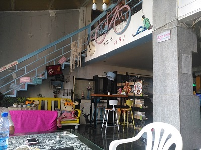

# 旅途-20180823-长沙托福考试

BRICKEA

2018年8月23日

## 只能用**惊艳**来形容的一段翻弹

在高铁上刷到的，2分10秒开始的solo太好听了

[尤克里里卡雷大师 Viva La Vida (生命万岁)](http://www.bilibili.com/video/av28068927?share_medium=android&share_source=copy_link&bbid=F5AC603D-4CFE-4B41-AD10-20C3E1B1479129467infoc&ts=1535001638247)

---

> 高铁上拍个照片这么高糊的吗

这一次托福考试应该说是最后一次了

不知道能考成什么样的成绩，自己做模拟，3000+的题量正确率大概是80%，折算成120满分的成绩也就保底96

希望自己能起码考到保底的成绩吧

> 青旅外面的天空

这是我第二次来长沙了，小时候跟老爸来这里过一次

那时候小不懂事，只吃肯德基

> 小纪念品

路上碰见郑州航空工业大学给了我个纪念品（为啥会在这里搞活动···）

他们讲东西的样子，让我想起来大一刚进支教团的时候

我给别人讲东西的时候，稳如老狗

其实内心慌的一批

> 青旅的公共场所（路飞青旅）

第一次住青旅，发现自己好多东西没带

没毛巾，没牙缸牙膏，没洗衣液

但这里有狗子和喵子

嗯，我别无他求了，佛了佛了

> 狗子叫逗逗，是个边牧

逗逗会没事一声吼，吓人一跳

> 喵子叫豆皮，有点蓝色的小灰猫

豆皮很小只，自己很安静地窝在灭火器旁边

（手机像素颜色炸了）

> 逗逗总是想上我们六人间的床

> 路飞青旅里的客人留下的痕迹

公共区域还有一个留言墙

都是大家的愿望和祝福

---

## 看完了就点我