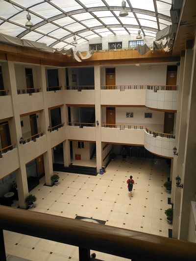
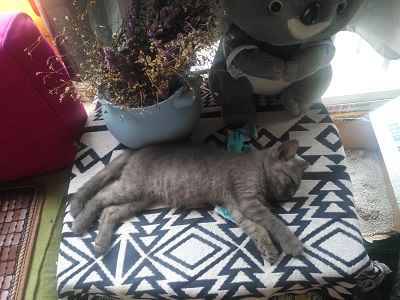
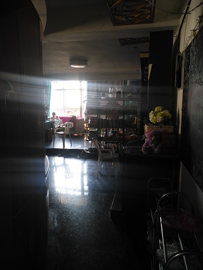
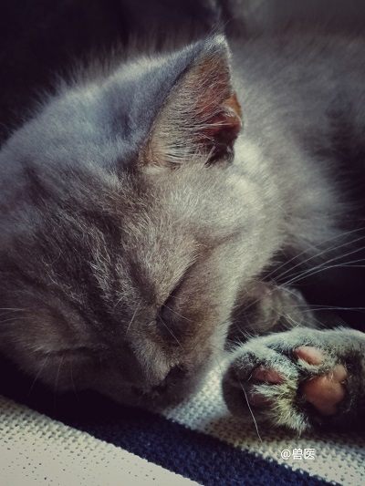

# 旅途-20180825-长沙托福考试

BRICKEA

2018年8月25日

## Close to you 听了好多还是汤神的最有味道

老爷子真是太快乐了

[Close to you](https://www.bilibili.com/video/av3842915?from=search&seid=11858013154468425312)

---

> 湖南大学外国语学院里面托福考场

想要来湖南大学考托夫的小伙伴

这里的考场挺不错的

进考场不用排号，先到先进，统一开始考试

存包的地方是那种摁一下出一个条形码的那种

所以没有钥匙

> 回到路飞这里撸猫

考完了才十二点半，火车是六点的

所以在青旅玩了一下午

> 青旅对面是一个商业楼，晚上的灯光挺好看

青旅阳台正对面是商业楼的花园天台，晚上很热闹

豆皮很喜欢跑到阳台石头堆里面睡觉

> 该走了

弹了一下午尤克里里

把教父的《Speak Softly Love》学会了

该回去了

---

> 兽医用手机照的！贼好看

在这里我认识了很多人

经常给大家带吃的的老板娘六六姐

来长沙新航道当助教的鸿顺哥

喜欢给逗逗喂蛋糕的北方大叔

喜欢和大家聊天聊地的贾姐

敢想敢做唱歌好听的老阿姨

用手机也能拍出来单反效果的摄影师兽医

时间虽短，余味犹存

以后相见于江湖，有缘再聚

---

## [看完了就点我](../README.md)